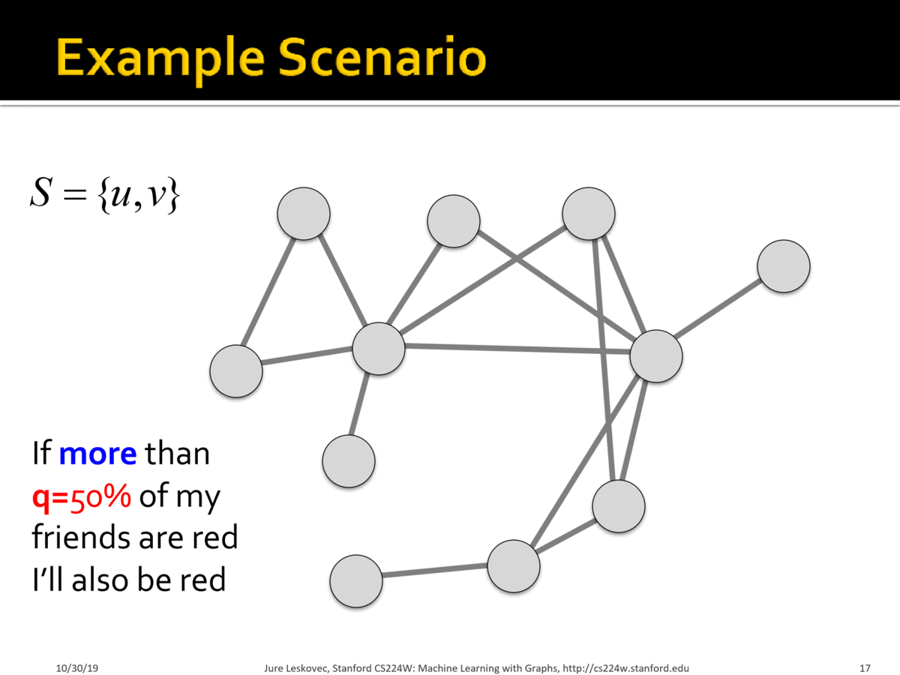
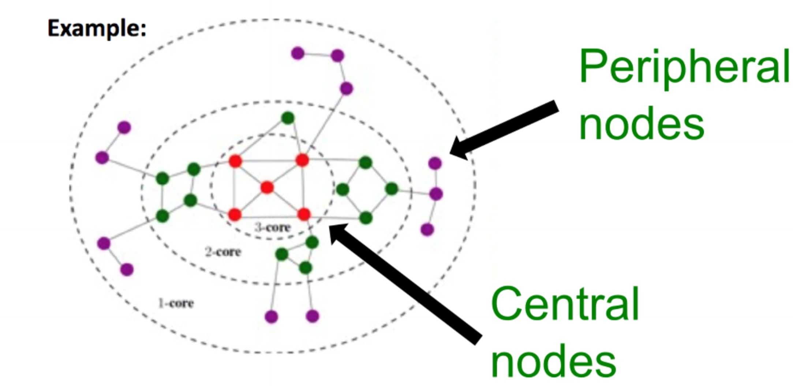

The phenomenon of spreading through networks and cascading behaviors is prevalent in a wide range of real networks.  Examples include contagion of diseases, cascading failure of technologies, diffusion of fake news, and viral marketing.  Formally, an **“infection” event** can spread **contagion** through **main players** (active/infected nodes) which constitute a propagation tree, known as a **cascade**. We will examine two model classes of diffusion:

通过网络的传播和级联行为在许多真实网络中普遍存在。 例如，疾病的蔓延，技术的级联失效，虚假新闻的传播以及病毒式营销。 形式上，**“感染”事件**可以通过构成传播树的主要节点（活动/感染节点）而传播出去，这称为“级联”。 我们将研究扩散的两个模型类别：

- Decision-based: each node decides whether to activate based on its neighbors' decisions. Deterministic rule, nodes are active players, and suited for modeling adoption
- Probabilistic: infected nodes "push" contagion to uninfected nodes with some probability. Can involve randomness, nodes are passive, and suited for modeling epidemic spreading
- 基于决策的：每个节点根据其邻居的决策来决定是否激活。 这是确定性的模型，节点是主动的，适用于建模接受或采取某种行为的过程。
- 概率的：受感染的节点以一定的概率将“感染”传播到未感染的节点。 涉及随机性，节点是被动的，适合于模拟流行病的传播。

# Decision Based Diffusion
## Game Theoretic Model of Cascades: single behavior adoption

The key intuition behind the game theoretic model is that a node will gain more payoff if its neighbors adopt the same behavior as it. An example is competing technological products: if your friends have the same type DVD players and discs (e.g. Blu-ray vs. HD DVD), then you can enjoy sharing DVDs with them.

博弈论模型背后的主要直觉是，如果节点的邻居采取与节点相同的行为，则该节点将获得更多的收益。 科技产品的竞争就是个例子：如果您的朋友拥有相同类型的DVD播放器和光盘（例如Blu-ray与HD DVD），那么您就可以与他们共享DVD的乐趣。

Every node independently decides whether to adopt the contagion depending upon its neighbors. The decision is modelled as a two-player game between a node and a given neighbor. Hence a node with degree $$k$$ plays $$k$$ such games to evaluate its payoff and correspondingly its behavior. The total payoff is the sum of node payoffs over all games.

每个节点都根据其邻居的选择，独立的决定是否选择这种策略。 该决策被建模为节点和给定邻居之间的两人游戏。 因此，度数为$ k $的节点会玩$ k $次这样的游戏，以评估其收益并相应地决定采取何种行动。 总收益是所有k次游戏的收益之和。

If there are two behavior $$A$$ and $$B$$ in the network and each node can adopt a single behavior, the payoff matrix for the two-player game is as follows:

如果网络中有两种行为$$ A $$和$$ B $$，并且每个节点可以采用一种行为，则两人游戏的收益矩阵如下：

|   | A | B |
|---|---|---|
| A | a | 0 |
| B | 0 | b |

where rows correspond to node $$v$$'s behavior, columns correspond to node $$w$$'s behavior, and entries represent each node's payoff.

其中行对应于节点$$ v $$的行为，列对应于节点$$ w $$的行为，条目代表每个节点的收益。

Let's analyze a node with $$d$$ neighbors, and let $$p$$ be the fraction of nodes which have adopted $$A$$. The payoff for choosing $$A$$ is $$apd$$ and the payoff for choosing $$B$$ is $$b(1-p)d$$. Hence the node adopts behavior $$A$$ if the following is met: 

分析具有$$ d $$个邻居的节点，并记$$ p $$为选择$$ A $$行为的邻居节点的比例。 则这个节点选择$$ A $$的收益为$$ apd $$，选择$$ B $$的收益为$$b(1-p)d$$。 因此，如果满足以下条件，则该节点将采取行为$$ A $$：
$$apd > b(1-p)d \implies p > \frac{b}{a+b}$$

We define $$q = \frac{b}{a+b}$$ to be the **threshold** fraction of a node's neighbors required for the node to choose $$A$$ i.e. requires $$p > q$$.

将 $$q = \frac{b}{a+b}$$定义为节点选择$$ A $$所需的比例**阈值**，即$$p > q$$时，节点采取A行为.

### Example:
Scenario:

场景：

- Graph where all nodes start with $$B$$
- 所有节点的起始选择均为$$ B $$
- Small set $$S$$ of early adopters of $$A$$. Hardwire this set such that these nodes will persistently use $$A$$ regardless of payoff
- 一个小的集合$$ S $$为行为$$ A $$的早期采用者。 固定这个集合，即这些节点将始终选择$$ A $$而不管收益如何
- Set $$a=b-\epsilon$$ and $$q = 0.5$$ for a small constant $$\epsilon>0$$. Interpretation: I adopt $$A$$ if more than 50% of my neighbors adopt $$A$$.   
- 设$$ a = b- \epsilon$$和$$ q = 0.5 $$，即如果超过50％的邻居采用$$ A $$，我将采用$$ A $$。

### 案例研究：[对社交网络上的抗议活动进行建模]

### Case Study: [Modelling Protest Recruitment on social networks](https://arxiv.org/abs/1111.5595)

Undirected network of Twitter users. 70 identified hashtags associated with 2011 Spain anti-austerity protests.

Twitter用户的无向网络。 70个与2011年西班牙反紧缩抗议活动有关的标签。

For each user (node):

对于每个用户（节点）：

- User activation time = moment when user starts tweeting protest messages
- $$k_{in}$$ = total number of neighbors at user activation time
- $$k_{a}$$ = number of activate neighbors at user activation time
- Activation threshold $$\frac{k_{a}}{k_{in}}$$ = fraction of neighbors that are active at user activation time
- 用户激活时间=用户开始发布抗议消息的时刻
- $$ k_ {in} $$ =用户激活时的邻居总数
- $$ k_ {a} $$ =用户激活时已激活的邻居数量
- 激活阈值$$ \frac{k_ {a}} {k_ {in}} $$ =在用户激活时处于已激活状态邻居的比例

Key Insights:

重要见解：

- The distribution of activation threshold had two local peaks: i) at $$\frac{k_{a}}{k_{in}} \approx 0$$, indicating many self-active users who join with without social pressure ii) at $$\frac{k_{a}}{k_{in}} \approx 0.5$$ indicating many users join once half their neighbors have. Remainder of distribution mostly uniform.
- 激活阈值的分布有两个局部峰值：i）在$$ \frac {k_ {a}} {k_ {in}} \approx 0 $$处，表明许多在没有社交压力的情况下加入的主动用户。ii）在$$ \frac {k_ {a}} {k_ {in}} \approx 0.5 $$，表示许多用户一旦一半的邻居加入，则他也加入。其余的大部分分布均匀。

- A "burst" of neighbors joining the movement has greater impact on users with high threshold and lesser impact on users with low threshold
- 邻居们突然的大量激活，对阈值较高的用户影响较大，而对阈值较低的用户影响较小

- Most cascades were small
- 大多数级联很小
- Larger cascades were started by users with higher $$k$$-core number i.e. more central. The $$k$$-core is defined as the largest connected subgraph where every node has at least degree $$k$$ and can be evaluated by iteratively removing nodes with degree less than $$k$$.
- 更大的级联由具有较高$ k-core $值（即更核心）的用户启动。 $$ k-core $$定义为最大的连通子图，其中每个节点至少具有度数$$ k $$。可以通过迭代地移除度数小于$$ k $$的节点来进行评估。
- 

## Extending Game Theoretic Model: multi-behavior adoption
A node can adopt both behaviors and become $$AB$$ by paying a cost $$c$$.  The resulting payoff matrix (without cost $$c$$ applied) is as follows:

节点可以通过支付费用$ c $来同时采取这两种行为并变为$$ AB $$。 这样的收益矩阵（暂时不算成本$ c $）如下：

|   | A | B | AB |
|---|---|---|----|
| A | a | 0 | a  |
| B | 0 | b | b  |
| AB| a | b | max(a,b)|

### Example: Infinite path graph 无线长条图
Let us examine an infinite path graph where everyone begins with behavior/product $$B$$ except for three nodes of the following cases.  Let us also set $$b=1$$.

考虑一个无限长路径的图，其中每个人都是行为B，除了交界处的三个节点。 还设置$$ b = 1 $$。

**Case 1**:**A-w-B** 

Payoffs for $$w$$: $$A: a$$, $$B: 1$$, $$AB: a+1-c$$

w选择三种行为的收益。下图代表(a,c)取值对和w应该选择的行为。

**Case 2**: **AB-w-B**

Payoffs for $$w$$: $$A: a$$, $$B: 1$$, $$AB: max(a, 1) + 1 -c$$

The graphs show how different regions of $$(a,c)$$ values impact the decision-based diffusion:

上图显示了$$(a,c)$$值的不同如何影响决策的传播：

- B->A (Direct Conquest): If $$a$$ and $$c$$ are both high, then the cost of being compatible to both products is not worth it and conversion to $$A$$ is direct
- B-> A（直接征服）：如果$$ a $$和$$ c $$两者都很高（a>1, c>1），那么与这两种产品兼容的成本就不值得了，直接转换为$$ A $$
- B->AB->A (Infiltration): If $$a$$ is high and $$c$$ is lower, users first transition to $$AB$$ before fully committing to $$A$$  
- B-> AB-> A（渗透）：如果$$ a $$高而$$ c $$低（a>1, c+1<a），则用户首先转换为$$ AB $$，然后再完全转为$$ A $$

# Probabilistic Diffusion
## Epidemic Model based on Random Trees
## Basic Reproductive Number $$R_0$$
## S+E+I+R Models
### SIR
### SIS
### SEIZ
### Example: rumor spreading
## Independent Cascade Model
## Exposure Curves